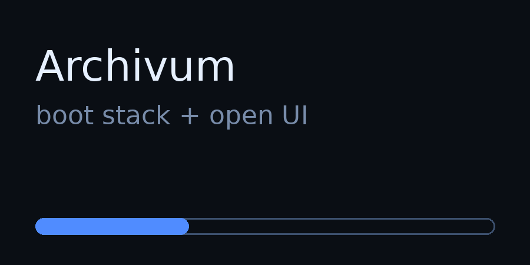

# Archivum

Self-hosted personal knowledge base that ingests files (docs, audio, video, email, and more), extracts structured notes via LLMs, and surfaces them through a wiki-style editor, semantic search, graph view, and an MCP server interface.

## Quick start (Docker Compose)

### 1) Configure

```bash
cp .env.example .env
# edit .env (ANTHROPIC_API_KEY / OPENROUTER_API_KEY / JWT_SECRET / OWNER_PASSWORD / MCP_API_KEY)
```

Or run the interactive config wizard:

```bash
make setup
# (also available as ./setup.sh)
```

### 2) Boot the stack

```bash
docker compose up -d --build
```

### 3) Open

- Web UI: http://localhost
- REST API: http://localhost:8000
- MCP SSE: http://localhost:8001/sse

### Optional: TLS / public share subdomain

If you set `ARCHIVUM_HOST` in `.env`, Caddy will serve:

- `https://$ARCHIVUM_HOST` (UI + API)
- `https://share.$ARCHIVUM_HOST` (read-only share links)

Also update the email in `caddy/Caddyfile` for Let’s Encrypt.

## MCP client setup (Claude Desktop / Claude Code / Cursor / VS Code)

Archivum’s MCP server is exposed in two ways (both use the same tools):

- SSE (HTTP): `http://localhost:8001/sse`
- stdio (in-container): via `docker exec` into the `archivum-mcp` container

### 1) Claude Desktop / Claude Code

Run:

```bash
make print-mcp-config
```

Then paste the printed JSON into your Claude config (typically `~/.config/claude/mcp_servers.json`).

### 2) Cursor / VS Code / Windsurf (settings.json)

Run:

```bash
make print-mcp-config
```

Then paste the printed `mcpServers` block into your editor settings.

## Demo



## Common operations

- Rebuild indexes:

```bash
curl -s -X POST http://localhost:8000/api/rebuild-indexes \
  -H "Authorization: Bearer $(grep MCP_API_KEY .env | cut -d= -f2)"
```

- View logs:

```bash
docker compose logs -f backend
```

## Graph export (local mock-safe demo)

Use the repo-owned mock graph fixtures (no DB required) and write inspectable artifacts to disk:

```bash
make graph-export-demo
```

This writes:
- `graph-export-out/graph.json`
- `graph-export-out/graph.html` (self-contained visualisation)
- `graph-export-out/manifest.json`

Also, the frontend graph endpoints are mock-safe:
- `GET /api/graph` falls back to the same demo graph if Kuzu DB export fails
- `GET /api/graph/demo` returns the demo graph explicitly

To open the HTML:
- macOS/Linux: `open graph-export-out/graph.html` / `xdg-open graph-export-out/graph.html`
- or just `file://.../graph-export-out/graph.html`

