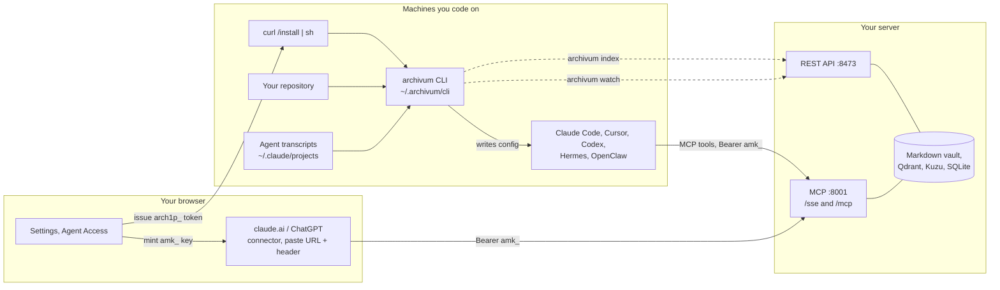
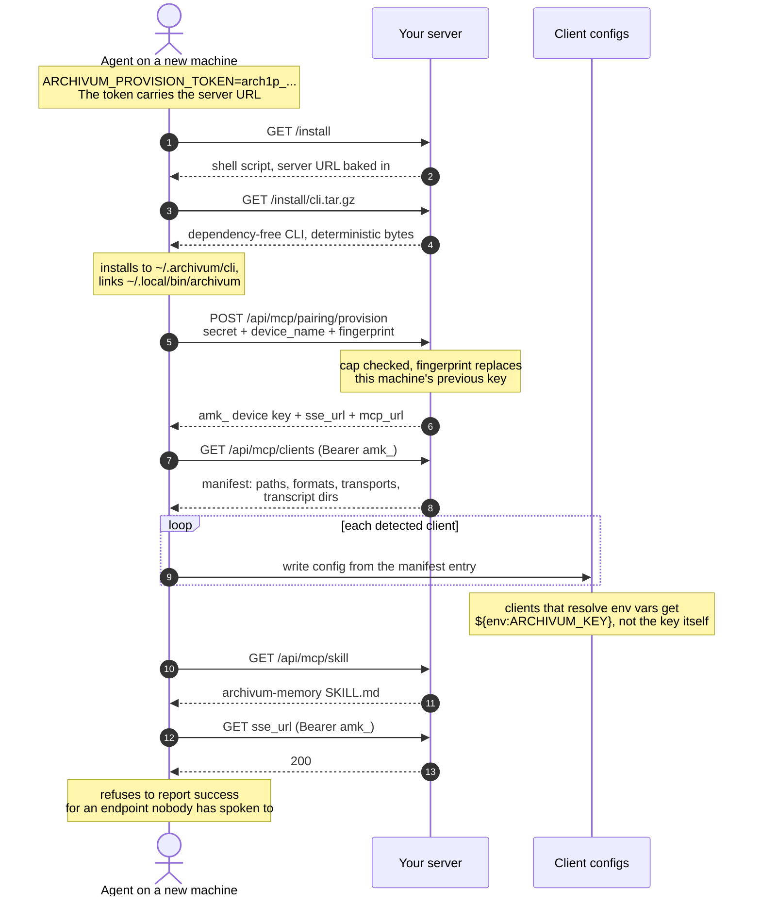
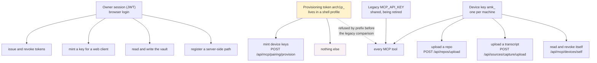
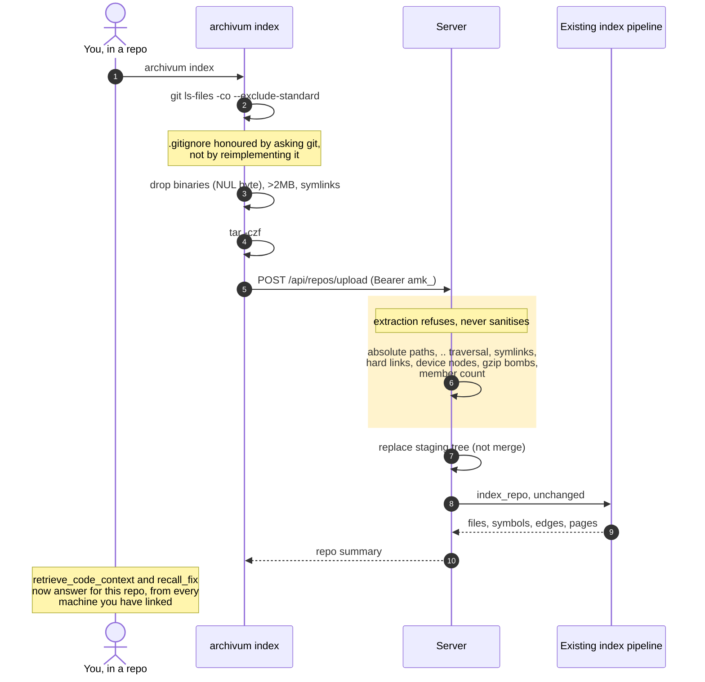
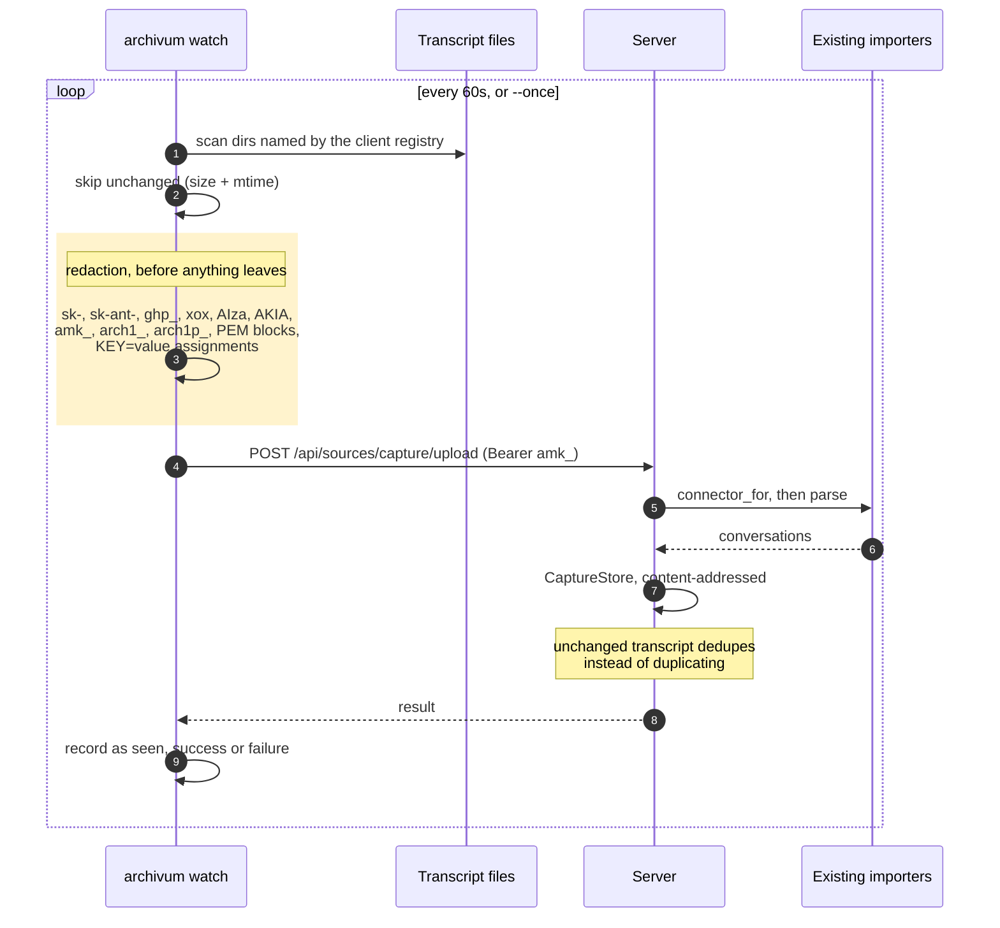
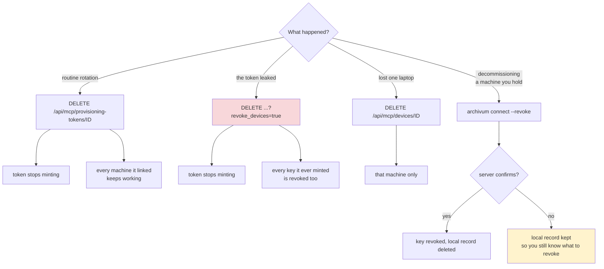
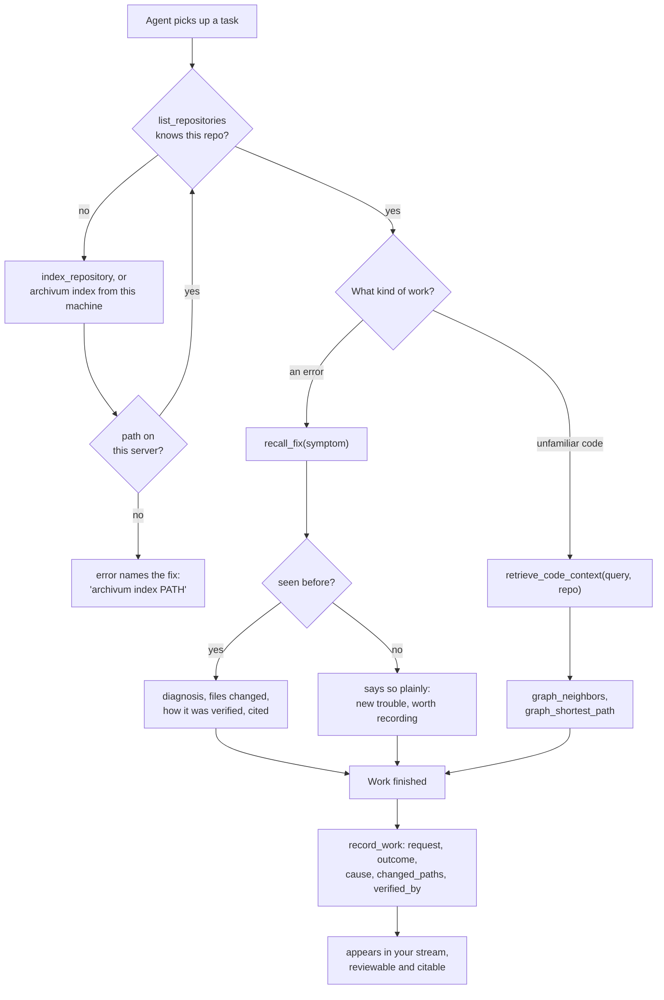

# Agent setup: the whole UX

Every path a person or an agent can take through setup, indexing, and capture.
Written to be audited: each box names the real route or file, so a claim here is
checkable against the code rather than taken on trust.

Routes are given in full. Router prefixes are `/api/mcp` (devices), `/api/repos`,
`/api/sources` (capture), and none (installer).

## 1. The whole picture

Three planes. The dashed line is the one that used to be impossible: the server
cannot read any client machine's disk, so everything crossing it is pushed by
the client rather than pulled by the server.

## 2. Linking a machine

The zero-touch path. The only input is one environment variable; everything
else the machine needs travels inside it or is fetched from the server.

## 3. What each credential can do

The centrepiece of the audit. Three credential classes, deliberately unequal.

The dotted edge is the property the key class exists for: `arch1p_` is rejected
in `DeviceBearerTokenVerifier.verify_token` *before* the constant-time legacy
comparison, so pasting one into `MCP_API_KEY` cannot turn a mint-only secret
into a read-everything one.

## 4. Indexing a repository

A refused archive leaves nothing behind. Replacing rather than merging is what
stops a file deleted since the last upload from surviving in the index.

## 5. Capturing sessions

Redaction is a set of shapes, not a guarantee. A secret that looks like prose
survives. Nothing starts this watcher automatically; it is opt-in per machine.

## 6. Revoking

Two different problems, two different answers, which is why there are two
buttons rather than one.

## 7. What an agent does with it

The `list_repositories` check at the top is what the skill now leads with. It
used to gate itself on the repository already being indexed, which at zero
repositories was permanently false, so it never ran and nothing was ever
indexed.

## 8. Where each surface lives

| Surface | Where | Auth |
|---|---|---|
| Issue, list, revoke provisioning tokens | Settings, Agent Access | owner |
| Link a device (pairing token) | Settings, Agent Access | owner |
| Mint a key for a browser connector | Settings, Agent Access | owner |
| Installer and CLI download | `GET /install`, `/install.ps1`, `/install/cli.tar.gz` | none, public code |
| Redeem a provisioning secret | `POST /api/mcp/pairing/provision` | the secret itself |
| Client manifest | `GET /api/mcp/clients` | device |
| Skill | `GET /api/mcp/skill` | none |
| Upload a repository | `POST /api/repos/upload` | device |
| Upload a transcript | `POST /api/sources/capture/upload` | device |
| Self status and self-revoke | `GET`/`DELETE /api/mcp/devices/self` | device |
| MCP tools | `:8001/sse` and `:8001/mcp` | device or legacy key |

## Known gaps

- OpenClaw's config path is seeded from documentation and flagged `unverified`
  in the registry. Sources disagree between `~/.openclaw/openclaw.json` with a
  top-level `mcpServers` key and `.openclaw/config.json` with nested
  `mcp.servers`. Confirm against an install; correcting it is a data edit.
- An uploaded tree carries no git history, so `since_sha` incremental indexing
  does not apply and each `archivum index` is a full reindex.
- Browser connectors need the vault reachable over public HTTPS. The Settings
  panel says so rather than leaving it to be discovered as a connector that
  never works.
